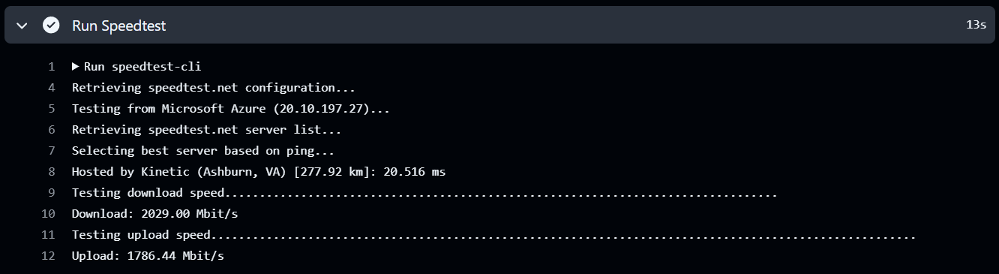

# 🏎️ GitHub Actions Speedtest

So... I was just curious one night:  
**"How fast is the internet inside a GitHub Actions runner?"**

I wasn’t planning to make anything useful.  
I just wanted to know because why not?

This repo is the result of that random curiosity.  
It runs a speedtest on GitHub’s runner using `speedtest-cli`. That’s it.
<br><br>
## 🤖 What does it do?

- Checks out the repo  
- Installs `speedtest-cli`  
- Runs a speedtest  
- Ends.

No fancy output. No data logging. Just a raw speedtest printed in the Actions log.  
But hey, it satisfied my curiosity 😅
<br><br>
## 🚀 How to run it yourself

If for some reason you also want to check GitHub's internet speed, here’s how:

1. Clone this repo:
    ```bash
    https://github.com/rafiarrafif/github-speedtest.git
    cd githubs-speedtest
    ```
2. Push it to your own GitHub repo:
    ```bash
    git remote set-url origin https://github.com/YOUR_USERNAME/YOUR_REPO_NAME.git
    git push -u origin main
    ```
3. Go to the **Actions** tab in your repo  
4. Trigger the workflow manually via **"Run workflow"**  
   Or just push a new commit to `main`
<br><br>
## 📸 The Result

Here's what the GitHub-hosted runner gave me:



(Yes, that’s fast. Probably faster than my home internet.)
<br><br>
## 🙃 Disclaimer

This is 99% useless and 1% educational.<br>
Don't expect too much. Or do. I won’t stop you.<br>
But hey, at least now I know and maybe you do too.<br>
<br><br>
## 📬 License

MIT. Clone it, fork it, laugh at it, or run it just for fun.
